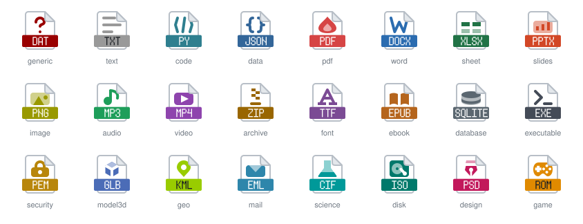

# MimeForge

[](https://www.npmjs.com/package/mimeforge) [](https://github.com/reachdevel/mimeforge/actions/workflows/ci.yml) [](LICENSE)

**Generate file-type icons as SVG from a file extension.**
A page with a type emblem and a colored extension label (`PDF`, `DOCX`, `ROM`, …), ready to drop into a file
browser, a download list or a docs site.



- **Tiny and crisp:** ~1.3 KB per icon, plain SVG shapes, no fonts or scripts, identical output on every run.
- **~1,365 known extensions** in 24 categories (via [mime-db](https://github.com/jshttp/mime-db) plus our own mappings). Anything unknown gets a generic icon (a question mark).
- **Size is up to you:** the SVG scales to any size, `` or `width="1024"`.
- **Everything is swappable:** colors, label font, and the icon bodies themselves.

## Why MimeForge exists

I needed file-type icons as **SVG**, and finding them turned out to be harder than it should be. The projects I could
find either shipped a fixed set of PNGs or generated PNGs, which means one file per size (16, 20, 32, 48, …) and blurry
results as soon as the size you need is not one of them. Their code was old, too, and a missing extension meant a
missing icon.

MimeForge starts from the other end: one small SVG per extension, generated on demand for any of the ~1,365
extensions it knows (and a sensible fallback for the rest). The size is a choice you make in your HTML, not something
baked into a file. Colors, fonts and the icon bodies are all replaceable, so it can match your product instead of the
other way around.

And, frankly, why not? :)

## Contents

[Quick start](#quick-start) · [Everyday use](#everyday-use) · [Customize](#customize) ([colors](#change-colors) · [label](#change-the-label) · [font](#change-the-font) · [bodies](#change-the-bodies) · [config file](#use-a-config-file) · [PNG](#export-png)) · [Edge cases](#edge-cases) · [Library API](#library-api) · [CLI reference](#cli-reference) · [Categories](#categories) · [Development](#development)

## Quick start

Requires Node.js 20 or newer.

**Try it, nothing to install:**

```bash
npx mimeforge pdf docx webm -o icons
```

This writes `icons/pdf.svg`, `icons/docx.svg` and `icons/webm.svg`. Use them like any image:

```html

```

**Install:**

```bash
npm i -g mimeforge     # a global `mimeforge` command
npm i mimeforge        # or as a dependency of your project (CLI via npx, plus the library API)
```

**From source** (to hack on it):

```bash
git clone https://github.com/reachdevel/mimeforge.git
cd mimeforge
npm install            # also builds the project
node dist/cli.js pdf docx webm -o icons
```

The examples below use the `mimeforge` command. Without a global install, put `npx` in front of it
(`npx mimeforge --all`); from a source checkout use `node dist/cli.js` or run `npm link` once.

### Use it in a project

Generate the icons at build time, so your app only ships the SVGs it needs:

```json
{
  "scripts": {
    "icons": "mimeforge --all -o public/icons"
  },
  "devDependencies": {
    "mimeforge": "^0.1.1"
  }
}
```

Then `npm run icons` and reference `/icons/<ext>.svg`. `public/icons/manifest.json` maps every extension to its
category, which is handy for lookups. If you only show a few types, list them instead of `--all`. To render icons at
runtime instead (a server, a build plugin), use the [library API](#library-api).

## Everyday use

```bash
mimeforge pdf docx webm -o icons        # a few icons
mimeforge --all -o icons                # every known extension, plus icons/manifest.json (ext → category)
mimeforge --list                        # which extension gets which category
mimeforge --test-run                    # visual check, see below
```

**See what you get:** `mimeforge --test-run` writes `out/test-run/index.html`. Open it in a browser. It shows one icon
per category, with its color, at 16, 48 and 128 px as plain `` tags, plus a label-length stress test. It accepts
all the options below (`--font`, `--body`, `--color`, …), so it is the quickest way to preview your changes.

Extensions are case-insensitive and a leading dot is fine: `mimeforge .PDF` is the same as `mimeforge pdf`.

## Customize

### Change colors

Every category has a default accent color. Override it per category, per extension, or for everything:

```bash
mimeforge pdf docx --color pdf=#0a7 --color .docx=#c06 -o icons   # category pdf, and only the extension .docx
mimeforge --all --accent '#3366cc' -o icons                       # one color for every icon
mimeforge --all --colors my-colors.json -o icons                  # many overrides from a file
```

`my-colors.json`:

```json
{ "pdf": "#d64545", "archive": "#996600", ".docx": "#2b6cb0" }
```

Keys without a dot are categories (see [Categories](#categories)); keys starting with a dot are single extensions.
Priority: `--accent` > extension color > category color > default. Colors are `#rgb` or `#rrggbb`.

The lighter tint inside the emblems is derived from the accent automatically, and the label text switches
between white and dark ink so it stays readable on light accents (like `kml`'s yellow-green).

### Change the label

```bash
mimeforge pdf --label-case lower -o icons   # "pdf" instead of "PDF"
mimeforge --all --no-label -o icons         # bodies only, no extension text
```

Custom label text (e.g. `WORD` on a `.docx` icon) is available through the [library API](#library-api).

### Change the font

The label font is pluggable. The default is [Monogram](https://datagoblin.itch.io/monogram), a CC0 pixel font.

```bash
mimeforge --test-run --font ./fonts/Inter-Bold.ttf        # any .ttf, .otf or .woff file
mimeforge --all --font ./my-pixel-font.json -o icons      # a bitmap font in the JSON format below
```

- **Outline fonts** (`.ttf`, `.otf`, `.woff`; not `.woff2`): glyph outlines are converted to SVG paths and scaled so the
  capital height fits the label. Nothing is embedded, so the icons do not need the font installed.
- **Bitmap fonts** (`.json`): drawn as crisp rectangles. Tiny example, a 3×3 font with two letters:

  ```json
  {
    "name": "Tiny",
    "cols": 3, "rows": 3, "advance": 4,
    "glyphs": {
      "A": ["###", "#.#", "#.#"],
      "B": ["##.", "###", "##."]
    }
  }
  ```

  `advance` is the distance between letters in cells; every glyph has `rows` strings of `cols` characters
  (`#` = filled). Optional `descender` adds rows below the baseline. See [docs/fonts.md](docs/fonts.md).

Check the font's license before you ship icons made with it.

### Change the bodies

A *body* is the SVG with the page shape and the type emblem. Point `--body` at a directory of `<category>.svg` files
or at a single SVG that is used for every type:

```bash
mimeforge --test-run --body ./my-bodies             # my-bodies/pdf.svg, my-bodies/code.svg, ...
mimeforge --all --body ./one-shape.svg -o icons     # the same body for everything
```

Categories you do not provide fall back to your `generic.svg`, then to the bundled body. A body only has to follow a
few rules (a 32×32 viewBox and two placeholder colors that MimeForge replaces with the accent). The rules, a ready-made
skeleton and a prompt for generating bodies with an AI design tool are in [docs/bodies.md](docs/bodies.md).
MimeForge prints a warning when a body breaks the rules.

### Use a config file

Put a `mimeforge.config.json` in the folder you run MimeForge from (or pass `--config path`) so you do not repeat flags:

```json
{
  "out": "icons",
  "font": "./fonts/Inter-Bold.ttf",
  "body": "./my-bodies",
  "colors": { "pdf": "#d64545", ".docx": "#2b6cb0" },
  "labelCase": "upper",
  "png": [16, 32, 48]
}
```

Relative paths are resolved against the config file. Command-line flags win over the file.

### Export PNG

SVG is the primary output, but some systems need raster images:

```bash
mimeforge pdf docx --png 16,20,32,48 -o icons
```

writes `icons/pdf.svg` and `icons/16/pdf.png`, `icons/20/pdf.png`, … Any size works. PNG export uses the
optional dependency `@resvg/resvg-js` (installed by default; if it is missing, MimeForge tells you).

## Edge cases

| Situation | What happens |
|---|---|
| Unknown extension (`mimeforge xyz`) | generic body (question mark) with the label `XYZ` |
| Long extension (`webmanifest`) | up to 6 letters are drawn at full size; longer text is scaled down proportionally to fit the label, and below about a third of the size letters are dropped from the end |
| Light accent color | label text switches to a dark ink when white would have less than 3:1 contrast |
| Character the font does not have | skipped |
| Extension with several mime types (`mp4`) | the first mime type that maps to a category wins |
| Same input twice | byte-identical SVG |
| Wrong path or option | `error: …` on stderr and exit code 1 |

How crisp the label looks: the default pixel font is aligned to a grid that matches a 48 px rendering, so the label
is perfectly sharp when an icon is shown at 48, 96, 144 px, … and still clean (just antialiased) at other sizes.
Outline fonts have no such grid.

An extension lands in the wrong category? See [docs/categories.md](docs/categories.md) for how the mapping works and
how to change it.

## Library API

Install with `npm i mimeforge`. The package is ESM, so use `import` (from CommonJS: `const { renderIcon } = await import('mimeforge')`).

```ts
import { renderIcon, loadFont, loadBodies, createPalette } from 'mimeforge';

renderIcon('pdf').svg;                                    // SVG string
renderIcon('docx', { accent: '#0a7', label: 'WORD' }).svg; // custom accent and label text

renderIcon('xyz', {
  font: loadFont('./fonts/Inter-Bold.ttf'),
  bodies: loadBodies('./my-bodies'),
  palette: createPalette({ pdf: '#d00', '.zip': '#fa0' }),
  category: 'archive',            // skip the lookup and force a category
  labelCase: 'lower',             // 'upper' (default) | 'lower' | 'none'
});
```

`renderIcon` returns `{ svg, ext, category, accent }`. Other exports: `categoryFor`, `allExtensions`, `CATEGORIES`,
`DEFAULT_PALETTE`, `validateBody`, `renderLabel`, `bitmapFont`, `outlineFont` (see `src/index.ts`). Types are included.

## CLI reference

```
mimeforge <ext...> [options]        write <out>/<ext>.svg for the given extensions
mimeforge --all [options]           every known extension + manifest.json
mimeforge --test-run [options]      HTML preview page (default dir: out/test-run)
```

| Option | Description |
|---|---|
| `-o, --out <dir>` | output directory (default `out`) |
| `--font <spec>` | `monogram` (default), a `.ttf`/`.otf`/`.woff` file, or a bitmap-font `.json` |
| `--body <path>` | a directory of `<category>.svg` files, or one `.svg` for every type |
| `--color <key=#hex>` | accent for a category (`pdf=#0a7`) or an extension (`.docx=#c06`); repeatable |
| `--colors <file>` | the same overrides as a JSON object |
| `--accent <#hex>` | one accent for every icon |
| `--label-case <upper\|lower\|none>` | label text case: `upper` (default), `lower`, or `none` (leave the text as is, which is the lowercase extension) |
| `--no-label` | draw bodies only |
| `--png <sizes>` | also write PNGs, e.g. `16,32,48`, to `<out>/<size>/<ext>.png` |
| `--config <file>` | JSON config (default `./mimeforge.config.json` if it exists) |
| `--list` | print `extension category` for every known extension |
| `-h, --help`, `-v, --version` | |

## Categories

| Category | Emblem | Examples |
|---|---|---|
| `generic` | question mark | unknown or rare formats |
| `text` | text lines | `txt` `md` `log` `ini` `tex` |
| `code` | `</>` | `py` `js` `ts` `html` `css` `sh` |
| `data` | `{ }` | `json` `yaml` `xml` `toml` `nt` |
| `pdf` | flame | `pdf` `ps` `xps` `fdf` |
| `word` | W | `docx` `doc` `odt` `rtf` `wpd` |
| `sheet` | table | `xlsx` `csv` `ods` `numbers` |
| `slides` | bar chart | `pptx` `odp` `key` |
| `image` | landscape | `png` `jpg` `gif` `svg` `webp` |
| `audio` | music note | `mp3` `wav` `flac` `m4a` |
| `video` | play button | `mp4` `mov` `webm` `mkv` |
| `archive` | zipper | `zip` `tar` `gz` `7z` `apk` `deb` |
| `font` | letter A | `ttf` `otf` `woff2` |
| `ebook` | open book | `epub` `mobi` `cbz` |
| `database` | cylinder | `sqlite` `sql` `mdb` |
| `executable` | terminal prompt | `exe` `dll` `msi` `class` |
| `security` | padlock | `pem` `crt` `gpg` `kdbx` |
| `model3d` | cube | `glb` `stl` `obj` `fbx` |
| `geo` | map pin | `kml` `gpx` `geojson` `shp` |
| `mail` | envelope | `eml` `ics` `vcf` `mbox` |
| `science` | flask | `fits` `nc` `cif` `mat` |
| `disk` | hard drive | `iso` `dmg` `vmdk` `vhd` |
| `design` | pen nib | `psd` `ai` `sketch` `fig` `indd` |
| `game` | gamepad | `rom` `nes` `wad` `sav` `swf` |

Default colors live in `src/palette.ts`. The category list and the extension mapping are described in
[docs/categories.md](docs/categories.md).

## Development

```bash
npm install            # installs and builds
npm test               # vitest
npm run dev -- pdf     # run the CLI from source (tsx)
npm run test-run       # build the HTML preview from source
npm run preview        # regenerate docs/preview.svg (after npm run build)
```

Project layout: `src/` (TypeScript, ESM), `assets/bodies/` (the 24 bundled bodies), `assets/fonts/` (Monogram as a
bitmap table), `tests/`, `docs/`, `third_party/` (font source and license texts).
See [CONTRIBUTING.md](CONTRIBUTING.md) to contribute.

## License

© 2026 Levent Kurt. [MIT](LICENSE). Third-party material (Monogram font, mime-db) is listed in [THIRD_PARTY.md](THIRD_PARTY.md).
